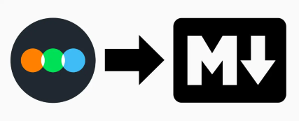

# Letterboxd Diary to Markdown

This Python project reads a user's Letterboxd diary via RSS feed and generates Markdown files summarizing their film viewing activity. 
It's a simple tool for backing up, sharing, or further processing your Letterboxd data.

## Features

* Parses your Letterboxd RSS feed.
* Extracts relevant movie data (title, year, rating, watched date, rewatch status, review, poster).
* Includes movie posters as embedded images in the Markdown.
* Generates a Markdown file with a table of your watched movies.

### Diclaimer
By the use of the RSS feed, the output is limited to the last 50 reviews.

## Installation

1. Clone the repository:
   ```bash
   git clone https://github.com/JorgeH18/letterboxd-markdown.git
   ```

2. Install requirements
   ```bash
    pip install -r requirements.txt
   ```

## Usage

1.  **Get your Letterboxd RSS URL:** Go to your Letterboxd profile and find the RSS feed link. It's usually something like `https://letterboxd.com/YOUR_USERNAME/rss/`.

2.  **Run the script:**

    ```bash
    python app.py
    ```

    The script will create a file named `letterboxd-diary.md` in the same directory.

## Optional Configuration

You can modify the following within the `main()` function:

*   `output_filename`: Change the name of the output Markdown file.
*   `markdown_title`: Change the title that appears at the top of the generated Markdown.
