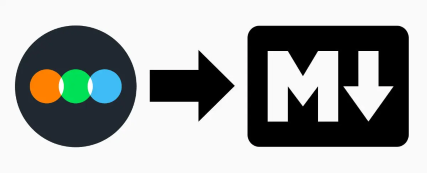

# Letterboxd Diary to Markdown

This Python project reads a user's Letterboxd diary via RSS feed and generates Markdown files summarizing their film viewing activity. 
It's a simple tool for backing up, sharing, or further processing your Letterboxd data.

## Features

* Reads your Letterboxd diary data.
* Creates an index Markdown file for the films you've logged.
* Includes key information like film title, rating, date watched, and review.

## Installation

1. Clone the repository:
   ```bash
   git clone https://github.com/JorgeH18/letterboxd-markdown.git

2. Install requirements
   ```bash
    pip install -r requirements.txt